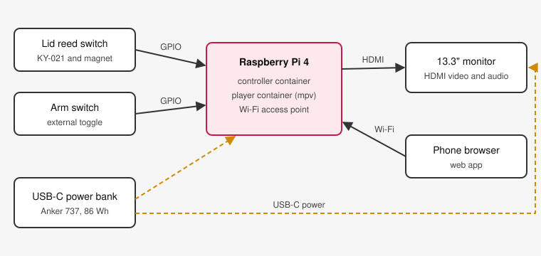

# Rickroll Briefcase

A briefcase that plays a video when a person opens it. The classic video is "Never Gonna Give You Up" by Rick Astley. Close the lid and the video stops. Open it again and the video starts again, immediately.



The briefcase contains a Raspberry Pi, a 13.3" portable monitor and a USB-C power bank. A reed switch and a magnet detect the lid. An external switch arms the briefcase. The Pi makes its own Wi-Fi network. You use a phone browser to select the videos and change the settings. The briefcase needs no internet connection.

## Features

- instant start when a person opens the lid, because the video is already loaded and paused
- instant stop when a person closes the lid
- external arm switch: switch it on and the briefcase is ready
- zero-touch operation: no keyboard, no mouse, no desktop and no windows
- a video library with upload, rename and delete in a phone web app
- a start position for each video, for example 00:30, with fixed, beginning, random and resume start modes
- single, cycle and shuffle selection modes
- loop or stop at the end of a video
- battery power for approximately 5 to 7 hours of playback
- all software in Docker containers, with a laptop mode for development without a Pi

## Important: Supply Your Own Video

This repository does **not** contain "Never Gonna Give You Up" or any other copyright music or video. You must supply a legally obtained copy of each video that you use. Do not download videos from streaming services if their terms do not permit it.

For development, the repository makes a generated test video with a visible timecode. Refer to [tools/README.md](tools/README.md).

## Quick Start on a Laptop

You need Docker with the Compose plugin.

```bash
git clone https://github.com/<owner>/rickroll_briefcase.git
cd rickroll_briefcase
./scripts/write_env.sh
./tools/make_test_video.sh
docker compose -f compose.yml -f compose.dev.yml up --build
```

Open <http://localhost:8080>. Use the "Lid" and "Arm" buttons to simulate the briefcase. The video plays in a window on your desktop.

## Quick Start on a Raspberry Pi

You need a Raspberry Pi 4 or a Raspberry Pi Zero 2 W with Raspberry Pi OS Lite (64-bit). Build the hardware first. Refer to the [hardware guide](docs/hardware/parts.md).

```bash
git clone https://github.com/<owner>/rickroll_briefcase.git
cd rickroll_briefcase
sudo ./scripts/install.sh --country DE
```

The script asks for a Wi-Fi password. It installs Docker, sets up the `RICKROLL-BRIEFCASE` access point, downloads the container images and starts the briefcase at each boot. Use your own Wi-Fi country code instead of `DE`. To build the images on the Pi instead of downloading them, add `--build`. Run `./scripts/install.sh --help` for all options.

Then do these steps:

1. Connect your phone to the `RICKROLL-BRIEFCASE` Wi-Fi network.
2. Open <http://10.42.0.1> in the phone browser.
3. Upload a video.
4. Turn on the arm switch and close the lid.
5. Give the briefcase to a friend.

## Documentation

| Document                                             | Content                                              |
| ---------------------------------------------------- | ---------------------------------------------------- |
| [Parts list](docs/hardware/parts.md)                 | the parts to buy, with prices                        |
| [Wiring](docs/hardware/wiring.md)                    | how to connect the reed switch, arm switch and power |
| [Assembly](docs/hardware/assembly.md)                | how to put the parts in the briefcase                |
| [Power](docs/hardware/power.md)                      | battery life and power measurements                  |
| [Architecture](docs/software/architecture.md)        | how the software parts work together                 |
| [Configuration](docs/software/configuration.md)      | all settings and their defaults                      |
| [Development](docs/software/development.md)          | how to run and test the software on a laptop         |
| [Player notes](docs/software/player.md)              | player and hardware test results                     |
| [Video tools](tools/README.md)                       | how to make test videos and convert your own videos  |

## Contributing

Contributions are welcome. Read [CONTRIBUTING.md](CONTRIBUTING.md) first.

## Licence

The software and the documentation use the [MIT licence](LICENSE). The licence does not cover videos that you add to the briefcase.
